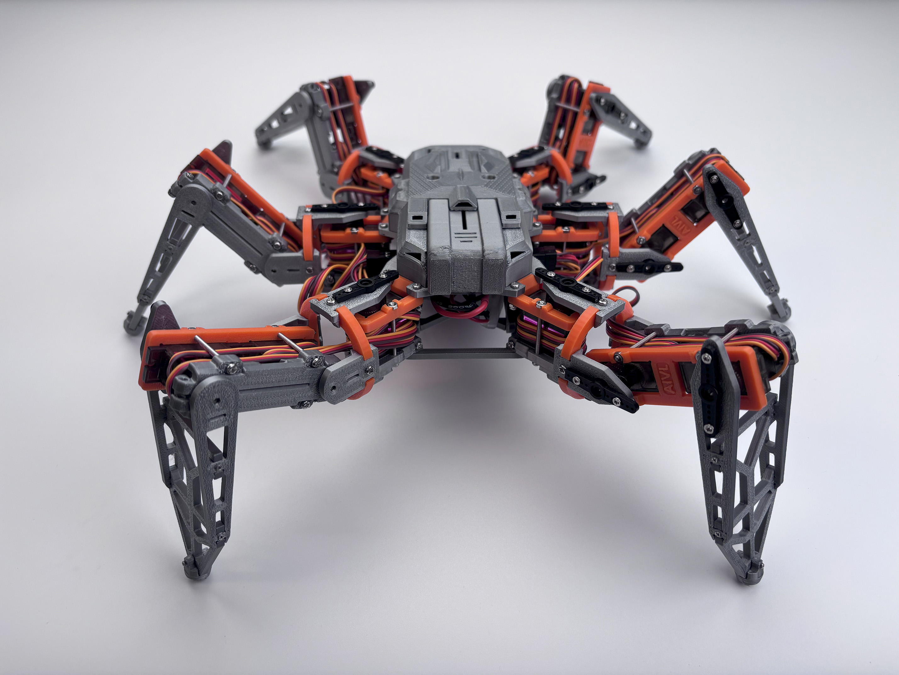
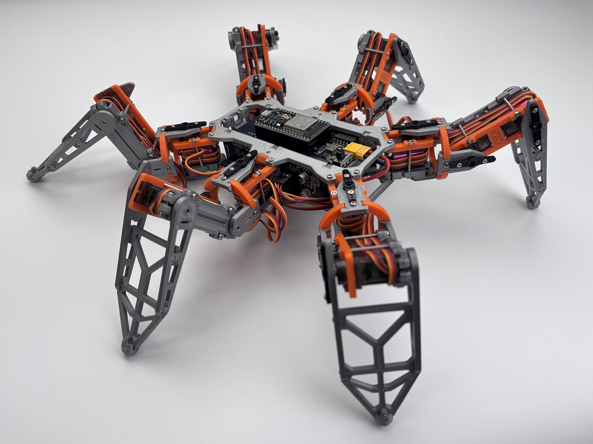
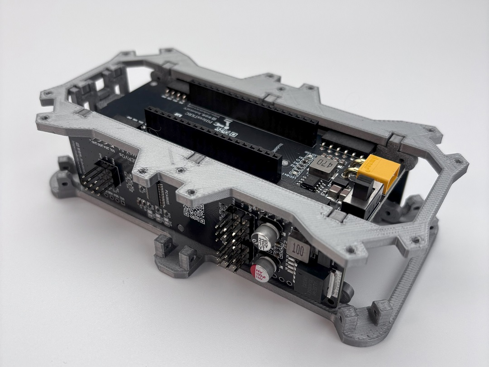
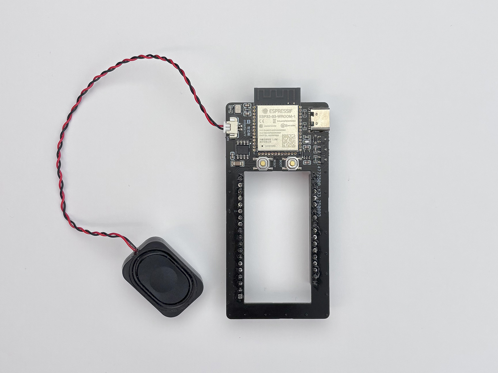
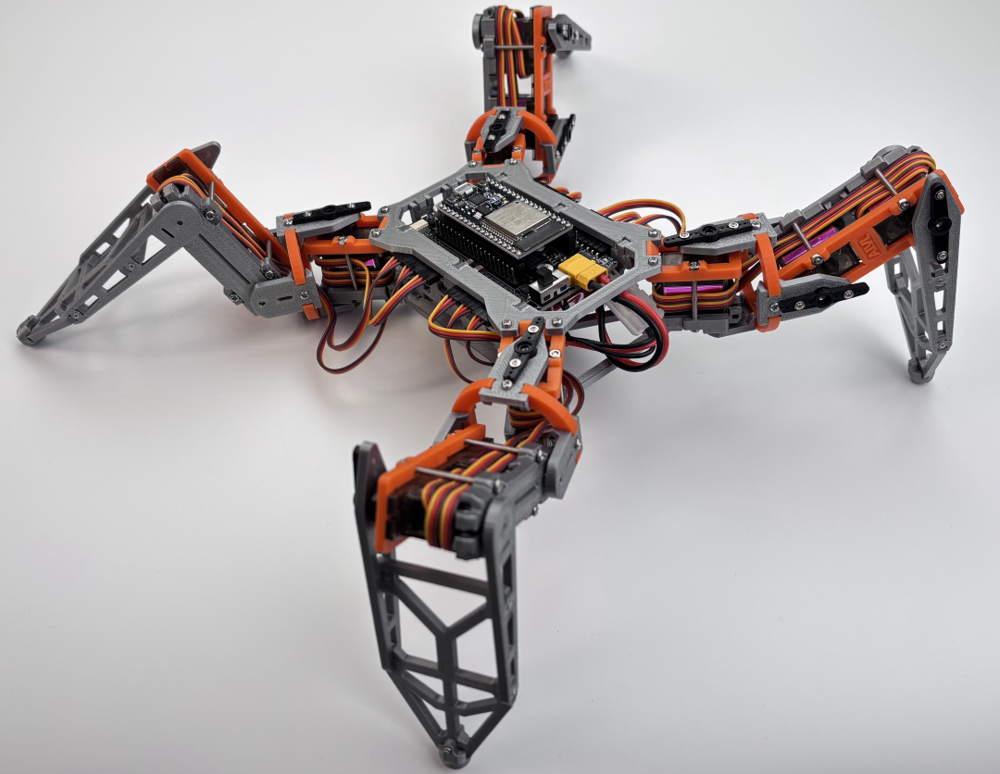
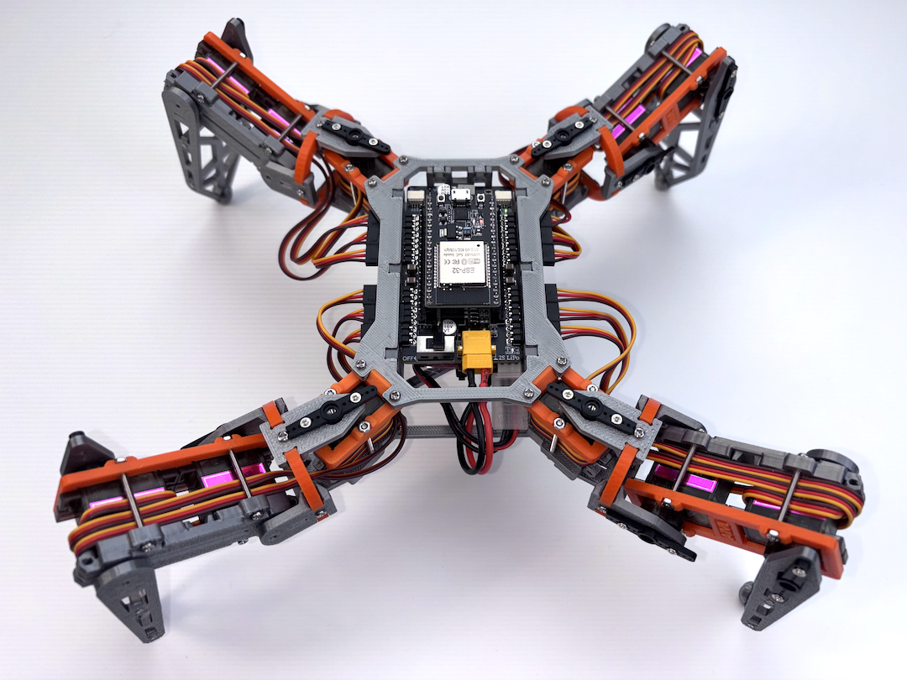
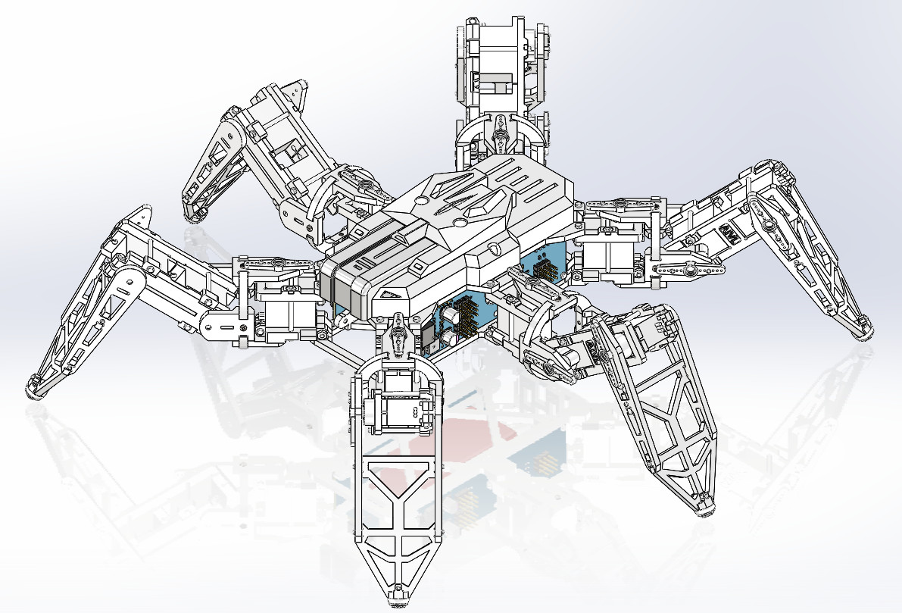
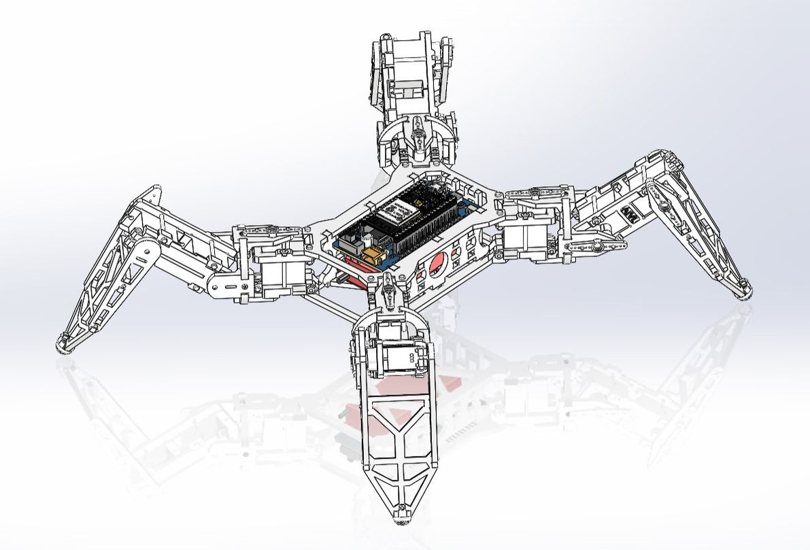

# 🤖 NodeHexa - 六足机器人（支持四足构型）

<div align="center">



**一个基于 ESP32 的六足机器人项目，同时额外支持四足构型固件；支持 Web 控制、校准与动作序列**

[](https://www.espressif.com/en/products/socs/esp32)
[](https://www.arduino.cc/)
[](LICENSE)
[](https://isocpp.org/)

</div>

## 📖 项目简介

NodeHexa 是一个开源的六足机器人项目，基于 ESP32 微控制器开发。项目集成了运动学算法、Web 界面控制、实时校准与动作序列（运动规划）能力，面向机器人爱好者与研究用途。

## 🧩 支持的构型

当前代码仓库同时提供 **四足构型固件** 支持，便于共用一套 Web UI、校准与运动控制框架。

| 构型 | 定位 | 支持范围 | 文档/图片现状 |
| --- | --- | --- | --- |
| **六足（Hexapod / NodeHexa）** | 主线 | 结构/硬件/固件/界面/教程 | 本 README 的示意图主要为六足；软硬件设计完全开源 |
| **四足（Quadruped / NodeQuadMini）** | 额外支持 | 结构/原理图/固件/界面 | 本 README 已包含四足展示图；硬件侧提供原理图参考（PCB 未开源）；待更新教程 |

> 结构件与紧固件差异：见 `mechanism/README.md`（已按六足/四足分别列出）。

## ✨ 核心特性

### 🧩 双构型支持（六足为主，四足为额外支持）
- **统一抽象接口** - 六足/四足共用控制与 Web 框架
- **构型差异隔离** - 六足与四足分别实现，互不影响主线功能演进

### 🎮 多种控制方式
- **Web界面控制** - 通过浏览器实时控制机器人运动
- **串口通信** - 支持UART2串口指令控制（调试和外接上位机用）
- **WebSocket通信** - 低延迟的实时数据传输
- **语音拓展（可选）** - 支持接入“小智 AI 拓展板”，实现语音交互控制

### 🚀 丰富的运动模式
- **基础移动**: 前进、后退、左转、右转
- **侧向移动**: 左移、右移
- **姿态控制**: X/Y/Z轴旋转、扭转动作
- **特殊动作**: 攀爬、快速前进
- **四足多步态切换**: 支持 Trot / Walk / Gallop / Creep 步态模式切换
- **动作序列（运动规划）**: 将多段动作按“周期/步数/距离/角度”等约束编排成序列，一键执行（见 `/planner`）

### 🔧 精确校准系统
- **实时校准** - 通过Web界面进行舵机角度可视化校准
- **参数保存** - 校准数据自动保存到Flash存储

### 🔋 安全保护功能
- **电池监测** - 实时监控电池电压
- **低电压保护** - 自动LED警告和系统保护

## 🏗️ 技术架构

### 硬件平台
- **主控**: ESP32 (NodeMCU-32S)
- **舵机驱动**: PCA9685 PWM驱动板
- **通信**: WiFi + UART2串口
- **存储**: SPIFFS文件系统
- **语音拓展（可选）**: 小智 AI 拓展板

### 软件架构
```
firmware/
├── src/
│   ├── main.cpp          # 主程序入口
│   ├── robot.h            # 统一机器人抽象接口（六足/四足共用）
│   ├── hexapod.h/cpp      # 六足实现
│   ├── quad_robot.h/cpp   # 四足实现
│   ├── leg.h/cpp          # 单腿控制（六足/四足各自实现/复用）
│   ├── movement*.h/cpp    # 运动控制算法与配置表
│   ├── motion_controller* # 动作序列/运动规划执行
│   └── calibration.h/cpp  # 校准系统
├── include/              # 头文件
└── lib/                  # 第三方库
```

## 🎯 运动控制算法

### 运动学计算
- **正运动学**: 根据关节角度计算足端位置
- **逆运动学**: 根据目标位置计算关节角度
- **坐标变换**: 世界坐标系与局部坐标系转换

## 🖼️ 项目展示

### 六足（NodeHexa）结构与硬件设计

<table>
  <tr>
    <td align="center">
      
      <br/>
      <em>六足结构</em>
    </td>
    <td align="center">
      
      <br/>
      <em>PCB套件</em>
    </td>
    <td align="center">
      
      <br/>
      <em>小智拓展</em>
    </td>
  </tr>
</table>

### 四足（NodeQuadMini）结构与硬件设计

<table>
  <tr>
    <td align="center">
      
      <br/>
      <em>四足结构</em>
    </td>
    <td align="center">
      
      <br/>
      <em>四足正面</em>
    </td>
    <td align="center">
      
      <br/>
      <em>四足主板</em>
    </td>
  </tr>
</table>

> 说明：四足版本当前开源 **原理图** 供学习与维护参考；PCB 相关文件不开放。
>
> 四足支持多种步态模式切换（Trot / Walk / Gallop / Creep）。

## 🛒 购买链接
- **套件购买**: [NodeHexa 六足机器人套件](https://item.taobao.com/item.htm?ft=t&id=810056770425)、[NodeQuadMini 四足机器人套件](https://item.taobao.com/item.htm?id=1022920495655)
- **电路板购买**：[NodeHexa 六足机器人电路板](https://item.taobao.com/item.htm?id=990145258187)
- **舵机购买（强烈推荐）**: [MG90s 舵机](https://item.taobao.com/item.htm?id=978672014892)
- **语音拓展板购买**: [小智AI拓展板（支持四、六足）](https://item.taobao.com/item.htm?id=989885356650)

> 强烈建议使用我们店铺上架的舵机：市面 MG90s 厂家众多，尺寸与质量差异较大；劣质舵机更容易过热/烧毁，后续成本更高。该链接为我们对多家产品测试对比后筛选的版本。

<div align="center">
  
  <br/>
  <em>六足三维模型预览</em>
</div>

<div align="center">
  
  <br/>
  <em>四足三维模型预览</em>
</div>

## 📱 复刻教程

<div align="center">

   
*扫描二维码，关注**公众号**发送"**六足**"查看详细复刻**教程**、**交流群**！*

</div>

或点击下方**【NodeHexa教程】**直接查看公众号文章列表：

<details>
<summary><strong>📚 NodeHexa教程</strong></summary>

### 系列教程

1. [六足机器人NodeHexa复刻教程（一）器材准备篇](https://mp.weixin.qq.com/s/QebT1wd3da98jmFbrUHNdA)
2. [六足机器人NodeHexa复刻教程（二）腿部组装篇](https://mp.weixin.qq.com/s/x1spemwsdwfix2QXKvCDqA)
3. [六足机器人NodeHexa复刻教程（三）机身组装篇](https://mp.weixin.qq.com/s/Z3uXM__K4puC-hbytVeSNw)
4. [六足机器人NodeHexa复刻教程（四）编译烧录篇](https://mp.weixin.qq.com/s/InIxQt30JFU6OhD7m3k71Q)
5. [六足机器人NodeHexa复刻教程（五）功能调试篇](https://mp.weixin.qq.com/s/-viItGeh79Q6JDqvxl3oZQ)

### 功能演示

- [【开源】必看！小智 AI 语音交互的六足机器人，带详细复刻教程，做不出来找我"算账"！（B站视频）](https://www.bilibili.com/video/BV19R4gzzEH7)
- [【开源】必看！小智 AI 语音控制六足机器人，开启未来趋势的探索之旅！（微信文章）](https://mp.weixin.qq.com/s/sWiMd9wZ3VoEhoh8ss6X7w)

</details>

## 🚀 快速开始

### 开发环境要求
- 推荐：安装 PlatformIO 插件的 VSCode IDE

### 连接和配置
1. 机器人开机后连接WiFi热点 "NodeHexa" (密码: roboticscv666)
2. 访问 `http://192.168.4.1` 进入控制界面
3. 进行舵机校准 (访问 `/calibration` 页面)
4. （可选）打开运动规划页面 (访问 `/planner` 页面) 编排动作序列
5. 开始控制机器人运动

## 📱 Web控制界面

### 主控制页面
- **运动控制**: 前进、后退、转向、侧移等
- **姿态控制**: 三轴旋转和扭转动作
- **校准功能**: 一键进入校准模式
- **运动规划**: 进入 `/planner` 编排并发送动作序列（单段动作也可直接执行）

### 校准页面
- **实时调整**: 每个舵机的角度微调
- **可视化反馈**: 实时显示调整效果
- **参数保存**: 自动保存校准数据

### 运动规划页面（动作序列）
- **单段动作**: 执行一段限定周期/步数/距离的动作（姿态类动作仅支持周期）
- **动作序列**: 多段动作串行执行（限制最多 5 段）


## ❓ 常见问题 (QA)

### 1. 六足舵机驱动板注意事项
**重要提醒**：左右两侧舵机驱动板电路设计完全相同，但在焊接元件时有细小差别。

- 舵机驱动板边缘的1×4P和1×6P排针只焊一侧，左右舵机驱动板焊接位置相反。
- DIY用户需要焊接左侧舵机驱动板的SJ1跳帽（购买套件的用户无需操作，出厂已焊接）。

**作用说明**：焊接跳帽后，左侧舵机驱动板的IIC地址将与右侧不同，避免两块驱动板地址冲突。两块舵机驱动板通过IIC协议与主控通信，地址相同会导致通信异常。

## 🎯 作者

- **B站**: [@智造师_RoboticsCV](https://space.bilibili.com/智造师_RoboticsCV)
- **GitHub**: [@ViolinLee](https://github.com/ViolinLee)
- **微信公众号**: RoboticsCV

## 🤝 贡献指南

欢迎提交Issue和Pull Request来改进项目！

## 🙏 致谢

- 基于 [hexapod-v2-7697](https://github.com/SmallpTsai/hexapod-v2-7697) 项目二次开发
- 参考 [PiHexa18](https://github.com/ViolinLee/PiHexa18) 项目设计
- 语音拓展来自 [xiaozhi-esp32](https://github.com/78/xiaozhi-esp32)
- 感谢所有开源社区的支持

---

<div align="center">

**⭐ 如果这个项目对你有帮助，请给它一个星标！**

**📺 关注B站 [@智造师_RoboticsCV](https://space.bilibili.com/智造师_RoboticsCV) 获取更多机器人项目**

**💬 关注公众号 `RoboticsCV` 获取技术文章和教程**

Made with ❤️ by [ViolinLee](https://github.com/ViolinLee)

---

Copyright © 2024 ViolinLee. Licensed under GPL-3.0.

</div>
